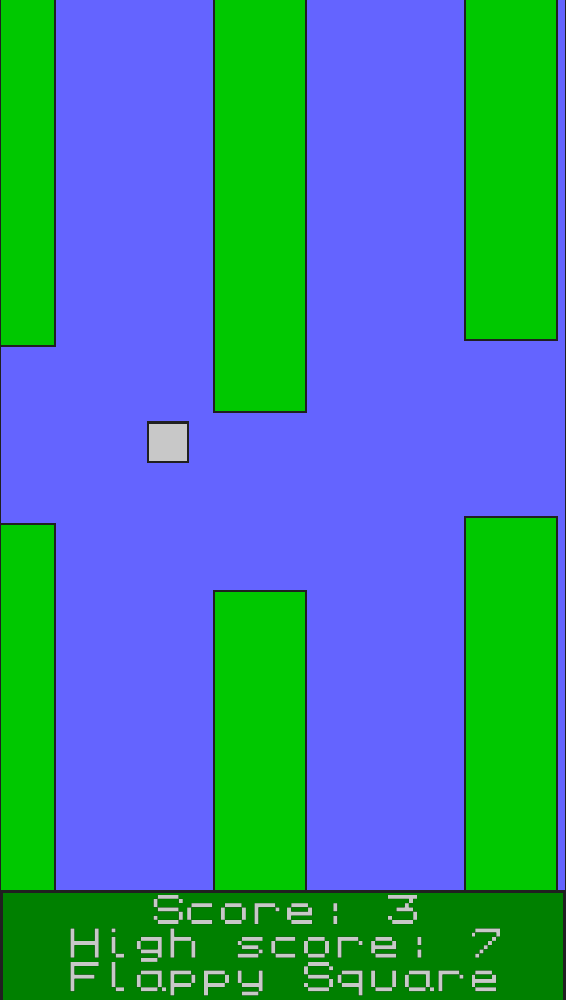

# Flappy Square

A Flappy Bird clone rendered using only squares in C.

     

I've tried to do nothing unusual in this project, and
program things as straightforward as I could. State (what
little of it there is) is global, as are things like the
window and the renderer.

It's fully playable, has game start and game over screens,
and keeps score and high score (not persistent).

I tried to keep this one one file, but the font code was
ballooning and getting in the way of the game code, so I
removed it to its own files.